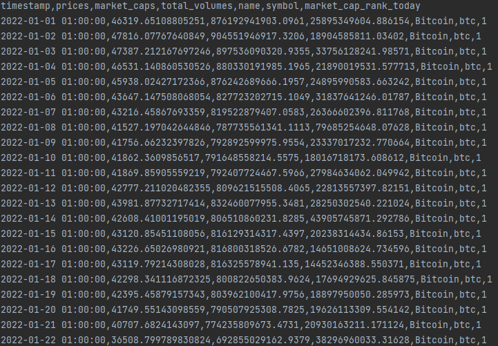
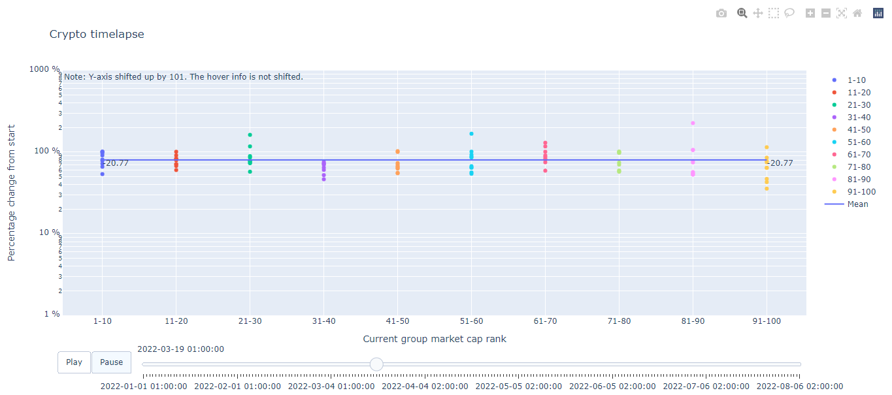

# Crypto-Timelapse

This repository was made to visualize a timelapse
of the percentage change from some date to today
of the crypto market.

For the visualization we used 
[Plotly](https://plotly.com/python/) for Python and
for obtaining the data we used the 
[CoinGecko API](https://www.coingecko.com/en/api/documentation)

## get_historical_data.py
This script it is used to get data of the crypto market. It 
supports different fiat currencies, different range intervals
and quantity of cryptos to show. Also, we can order de data by
different values.

It returns a [.csv](CryptoData_20220101010000_20220806020000.csv) with the prices, market cap, total volume, 
name and symbol of the crypto, current market cap rank 
(at current time) per datetime.

To obtain the current .csv we used:
```
python get_historical_data.py 2022-01-01
```
To see all the options use:
```
python get_historical_data.py -h
```

## data_timelapse.py
**NOTE:** The Y-axis is shifted up by 101. This was used to implement log scale
Other info is displayed correctly.


This script it is used to create an animated plot. It supports
three modes:
- plot all the symbols
- plot symbols with common date range
- plot symbols that have all date range

It returns a [.html](data_timelapse_symbols_all_date_range_20220101010000_20220806020000.html) with the animated plot that auto opens in
the browser.

To obtain the current .csv we used:
```
python data_timelapse.py CryptoData_20220101010000_20220806020000.csv --type_data symbols_all_date_range
```
To see all the options use:
```
python data_timelapse.py -h
```

## Preview




## References
- [CoinGecko API](https://www.coingecko.com/en/api/documentation)
- [Plotly](https://plotly.com/python/)
- [Python API reference for plotly](https://plotly.com/python-api-reference/index.html)